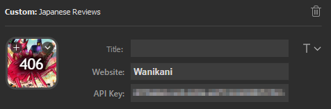

# Stream Deck Japanese Reviews

A collection of review trackers for various Japanese review websites. The following sites are supported:

| Name     | Description     | Website              |
| -------- | --------------- | -------------------- |
| Bunpro   | Grammar & Vocab | https://bunpro.jp    |
| Wanikani | Kanji           | https://wanikani.com |
| MaruMori | Grammar & Vocab | https://marumori.io  |

Icons for each website are shown with a counter of the number of reviews currently waiting, which updates every 10 minutes. Updates are timed to 1 minute after the hour to ensure hourly updates (esp. Wanikani) are shown as soon as possible.

Clicking on each button will open to the relevant website in your default browser, with reviews being one click away.

## Getting Started

This plugin requires the Stream Deck software to be installed on your computer.

There are a few ways to utilize this Stream Deck plugin:

1. (Recommended) Download the latest released version from the Stream Deck store by searching for "Japanese Reviews"

2. Download the latest released version from Github and run `com.ascend.japanesereviews.streamDeckPlugin`.

3. Copy the entire `com.ascend.japanesereviews.sdPlugin` folder under `/src` into the following folder:
    * On Windows: `%appdata%\Elgato\StreamDeck\Plugins\`
    * On macOS: `~/Library/Application Support/com.elgato.StreamDeck/Plugins/`

## Building

Building is optional and only necessary for packaging the `.streamDeckPlugin` for distribution. For local usage and testing, copying the entire sdPlugin to the Stream Deck plugin folder is sufficient.

To build, simply run `/build/build.ps1` using Powershell, navigate to the build directory and run the following command:

`./DistributionTool -b -i ../src/com.ascend.japanesereviews.sdPlugin -o ./`

A `.streamDeckPlugin` file will be output in the build folder, which can be run to install the plugin.

## Contributing

Feel free to suggest feature changes or add support for additional Japanese review sites by opening a pull request.

Run `npm install` from the `/src` folder to retrieve ESlint configuration. All javascript files follow Airbnb Javascript coding styles.